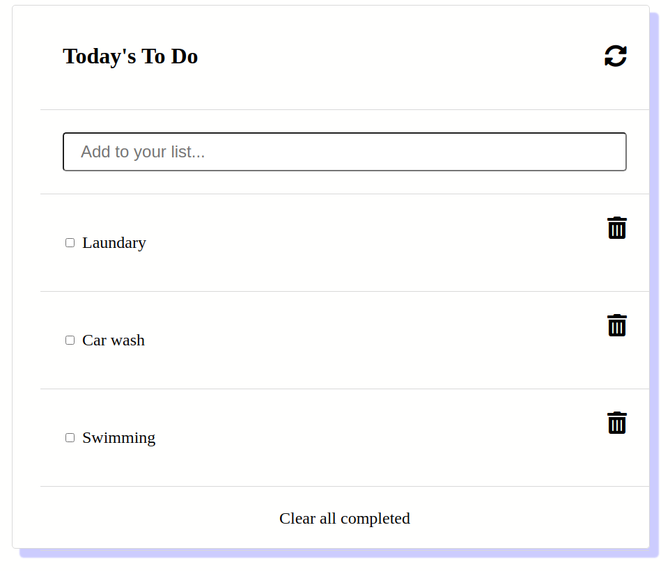

# To Do List

> This is a simple app that will enable you to manage your daily activities. For this milestone, I added a feature to enable you reorganise your todo list. 

features:
- Interface to add a task 
- Tick a task as complete
- Drag and drop to reorganize tasks
- Update the local storage
- Add a task through the input textbook
- Delete all completed tasks

## Built With

- Javascript
- Webpack
- Html/CSS

## Live Demo

[Live Demo Link](https://mihndim2020.github.io/To-Do-List/)

## Getting Started

### Prerequisites

- node.js
- Javascript
- Git and Github
- Terminal
- browser

### Setup

- clone the following repo link, git@github.com:Mihndim2020/To-Do-List.git
- cd into the directory and run npm install to install dependencies
- run npm run build
- run npm start

### Usage

- run index.html in your favorite browser to display the interface.

### Usage
- Install jest
- In terminal, run: npx jest

## Author

👤 **Mih Julius Ndim **

- Github: [@Mihndim2020](https://github.com/Mihndim2020)
- Twitter: [@mihndim](https://github.com/mih-julius) 
- Linkedin: [Mih Julius](https://www.linkedin.com/mih-julius)

## Show your support

Give a ⭐️ if you like this project!

## Acknowledgments

- Hat tip to anyone whose code was used
- Inspiration
- etc

## 📝 License

This project is [MIT](https://github.com/Mihndim2020/To-Do-List/blob/develop/LICENSE) licensed.